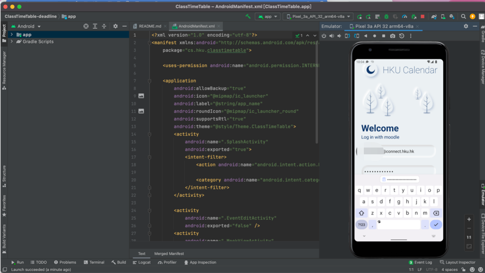
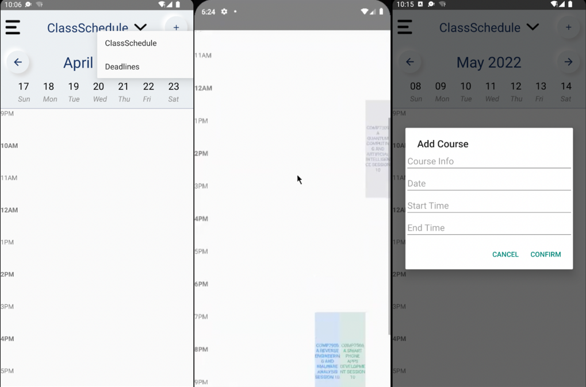
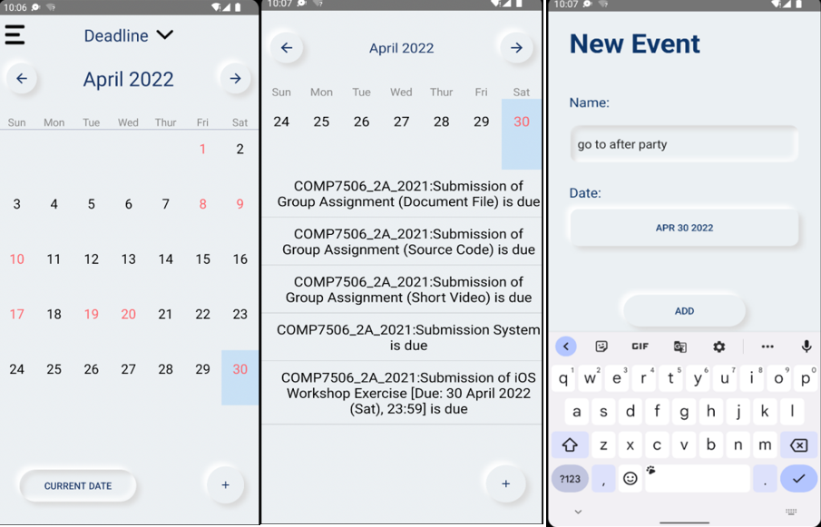

# COMP7506 APP Group Project-HKU Calendar

## 1. Intro
This is a tool app designed to facilitate learning and life of HKU Student. In the era of increasing learning tasks, students need an app to record their courses, assignments, group discussions, interviews and other tasks. It is more like a learning schedule. In the comparison of the other two curricula, we have developed this App.

## 2. Use
* Clone.
* Open in Android Studio and Build.
* Device: Pixel 4 API 28
* Run
* Input HKU UID and Password

## 3. Feature
* ClassSchedule  
The default page after logging in is ClassSchedule, which will display the course schedule by week according to the course information in the students’ moodle system and the course information customized by the student.  

* Deadline  
The Deadline page implements features that we think hku students are very much in need of, including displaying a monthly calendar and showing dates with ddl in red, clicking on a date will show a list of ddl.  

